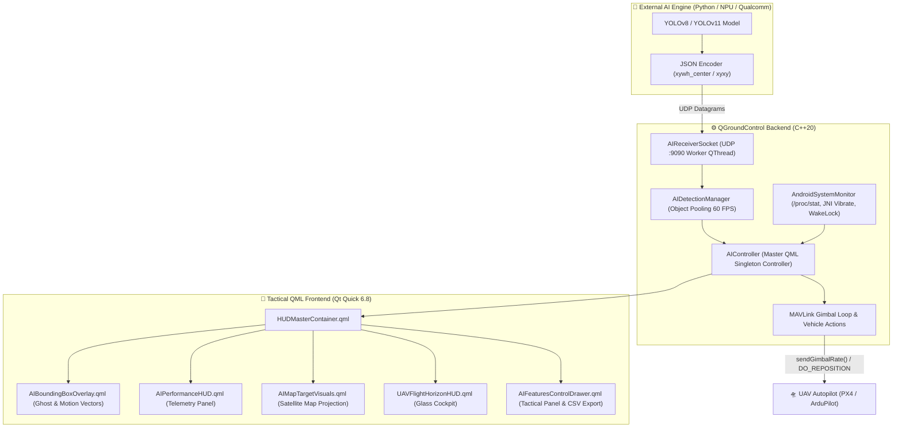

<p align="center">
  
</p>

<p align="center">
  <a href="https://github.com/TheKods/Ampuh-Gen-1/releases/latest"></a>
  
  
  
  
</p>

<p align="center">
  <a href="https://github.com/TheKods/Ampuh-Gen-1/releases/latest"><b>📥 Download Release v1.0.0 (Windows & Android APK)</b></a> •
  <a href="AI_HUD_MASTER_DOCUMENTATION.md"><b>📖 Master Documentation</b></a> •
  <a href="RELEASE_NOTES_v1.0.0.md"><b>📑 Release Notes</b></a>
</p>

---

# 🛸 AMPUH Gen 1 — Tactical Autonomous AI GCS
> **Military-Grade Tactical Ground Control Station with Integrated YOLO AI Surveillance, MAVLink Autonomous Gimbal Tracking, and Mobile Field Optimization.**

**AMPUH Gen 1** adalah stasiun kendali darat generasi mutakhir (*Advanced Tactical GCS*) yang dirancang khusus untuk misi pengawasan otonom UAV (*Surveillance & Reconnaissance*), operasi SAR (*Search and Rescue*), pemetaan taktis, dan kendali presisi wahana terbang berbasis **PX4** maupun **ArduPilot**.

---

## 📺 TAMPILAN TACTICAL HUD COCKPIT (WIREFRAME)

```text
+====================================================================================================+
| [⚡ STANDBY | ONLINE]    [ ALL | 🟢 PERSON | 🔵 VEHICLE | 🟡 BOAT ]    [⏭️ NEXT] [🔄 HUD] [⚙️ AI CTRL]|
+----------------------------------------------------------------------------------------------------+
| ┌───────────────┐                                                                 ┌──────────────┐ |
| │ AI TELEMETRY  │                     ⚠️ PERIMETER BREACH: VEHICLE #101           │ SATELLITE MAP│ |
| │ FPS: 60 / 31.5│                                                                 │   (TARGET)   │ |
| │ INF: 24.8 ms  │                                                                 │      🎯 #101 │ |
| │ NPU: 74% (ARM)│                   ┌──                 ──┐                       │  [PROJECTED] │ |
| │ TMP: 39°C NORM│                   │   🎯 TARGET #101    │                       │  LAT: -6.2088│ |
| └───────────────┘                   │   [VEHICLE - 95%]   │                       │  LON:106.8456│ |
|                                     │                     │                       └──────────────┘ |
|                                     │          ▲          │                                        |
|                                     │       (HEADING)     │   [ 🚁 FLY TO ]                        |
|                                     └──                 ──┘   [ 🔄 ORBIT  ]                        |
|                                     [RNG: 140m | 38km/h | THR: 85%]                                |
|                                                                                                    |
|            ──|──                   ─────────────────────                   ──|──                   |
|           120 KT                        - - 10 - -                        350 M                    |
|           [115]                        ─────────────                      [340]                    |
|           110 KT                        - - 10 - -                        330 M                    |
|                                                                                                    |
+----------------------------------------------------------------------------------------------------+
| [MODE: GUIDED] | [BAT: 22.8V - 88%] | [SAT: 18 FIX] | [ALT: 50.0m AGL] | [DIST: 420m] | [GMB: -45°]|
+====================================================================================================+
```

---

## ⚡ FITUR UTAMA & APEX CAPABILITIES

### 1. 🤖 Apex Tactical AI Surveillance Engine
* **YOLO Native Integration:** Terhubung langsung ke engine YOLO (YOLOv8 / YOLOv11 / YOLO-NAS) via UDP IPC Socket Port `9090`.
* **Autonomous MAVLink Gimbal Tracking:** Kamera gimbal drone secara otomatis berputar (*pitch/yaw rate loop 20 Hz*) mengunci sasaran bergerak.
* **Ray-Casting GPS & Satellite Map Sync:** Memproyeksikan bounding box video ke koordinat GPS bumi nyata dan menampilkannya sebagai target bercahaya di [FlyViewMap](src/FlyView/FlyViewMap.qml).
* **Ghost Tracking (Occlusion Recovery):** Menampilkan kotak bayangan `👻 GHOST PREDICTED` jika target tertutup pohon/gedung selama 1–3 detik.
* **Threat & Priority Matrix (0–100%):** Penilaian ancaman otomatis (`[THR: 85%]`) berdasarkan kecepatan dan jarak objek.
* **Virtual Perimeter Defense:** Sirine alarm otomatis dan banner merah berkedip saat objek melintasi batas aman ($50\text{m} - 500\text{m}$).
* **Action Shortcuts:** Tombol instan **[ FLY TO ]** (`MAV_CMD_DO_REPOSITION`), **[ ORBIT ]** (`MAV_CMD_DO_ORBIT`), dan **[ LOCK ROI ]** (`MAV_CMD_DO_SET_ROI_LOCATION`).

### 2. 📱 Android & Mobile Field-Ready Optimization
* **Haptic Vibration Feedback:** Getaran taktis $60\text{ ms}$ di HP/Tablet Android via JNI Vibrator saat target disentuh/dikunci.
* **2-Finger Swipe Gesture:** Usap 2 jari di layar sentuh untuk berganti mode HUD secara instan.
* **Sunlight High-Contrast Mode:** Tampilan kontras ultra-tajam anti-silau terik matahari siang hari.
* **Smart WakeLock (Anti-Sleep):** Layar tablet/HP tidak akan mati otomatis selama misi pelacakan AI berlangsung.

### 3. ✈️ Military Dual-Mode Glass Cockpit HUD
* **HUD Mode Switcher (3-State):** Beralih instan antara **HUD AI**, **HUD Telemetri UAV**, atau **Hybrid Mode**.
* **Glass Cockpit Instruments:** Artificial Horizon militer, Pitch Ladder, Pita Kecepatan vertikal, Pita Ketinggian, Kompas Heading pita atas, dan Status Bar telemetri baterai/GPS.
* **Vision Shaders:** Filter visual video taktis: *Normal RGB*, *Night-Vision Green Phosphor*, *Ironbow Thermal Heatmap*, dan *White-Hot FLIR*.

---

## 🏗️ ARSITEKTUR SISTEM & ALIRAN DATA



---

## 📊 TABEL MATRIKS FITUR DUAL-MODE HUD

| Fitur / Komponen | HUD AI Mode 🤖 | HUD UAV Mode ✈️ | Hybrid Mode 🌐 | Android Mobile 📱 |
| :--- | :---: | :---: | :---: | :---: |
| **Bounding Box & Corner Brackets** | ✅ Aktif | ❌ Tersembunyi | ✅ Aktif | ✅ Tap-to-Lock |
| **Prediksi Ghost Box & Occlusion** | ✅ Aktif | ❌ Tersembunyi | ✅ Aktif | ✅ Aktif |
| **Panel Performa (FPS/Latensi/NPU)**| ✅ Aktif | ❌ Tersembunyi | ❌ Tersembunyi | ✅ Native Read |
| **Artificial Horizon & Pitch Ladder**| ❌ Tersembunyi | ✅ Aktif | ❌ Tersembunyi | ✅ Smooth 60 FPS |
| **Speed & Altitude Vertical Tapes**| ❌ Tersembunyi | ✅ Aktif | ❌ Tersembunyi | ✅ Mil-Spec |
| **Proyeksi Target ke Peta Satelit** | ✅ Aktif | ✅ Aktif | ✅ Aktif | ✅ Real-time GPS |
| **Perintah MAVLink (FlyTo / Orbit)**| ✅ Aktif | ❌ Tersembunyi | ✅ Aktif | ✅ Quick Buttons |
| **Haptic Vibration Feedback** | ✅ 60 ms | ✅ 40 ms | ✅ 60 ms | ✅ JNI Vibrator |
| **Gestur Usap Layar (2-Finger)** | ✅ Aktif | ✅ Aktif | ✅ Aktif | ✅ Touch Native |

---

## 📡 FORMAT DATA JSON UNTUK DEVELOPER AI

Kirim paket JSON via **UDP ke `127.0.0.1:9090`**:

```json
{
  "detections": [
    {
      "id": 101,
      "class": "Vehicle",
      "confidence": 0.95,
      "box": [0.35, 0.40, 0.16, 0.12],
      "format": "xywh_center"
    },
    {
      "id": 102,
      "class": "Person",
      "confidence": 0.89,
      "box": [0.55, 0.60, 0.08, 0.15]
    }
  ],
  "performance": {
    "inference_fps": 31.5,
    "stream_fps": 60.0,
    "latency_pre_ms": 2.1,
    "latency_inf_ms": 24.8,
    "latency_post_ms": 3.6
  },
  "hardware": {
    "cpu_usage_pct": 28.0,
    "gpu_usage_pct": 74.0,
    "ram_usage_mb": 320.0,
    "engine_backend": "YOLOv8 NPU (Qualcomm)"
  }
}
```

---

## 🚀 PANDUAN MEMULAI CEPAT (QUICK START)

### 1. Prasyarat Sistem
* **OS:** Windows 10 / 11 (64-bit), Linux (Ubuntu 22.04+), atau Android SDK/NDK
* **Compiler:** Visual Studio 2022 (MSVC C++ Desktop) atau Clang (Android NDK r26+)
* **Framework:** Qt 6.8+ (Quick, Location, Positioning, Network)
* **Build Tools:** CMake 3.25+ & Ninja

### 2. Kompilasi & Menjalankan (Windows)
```powershell
# 1. Konfigurasi CMake otomatis
just configure

# 2. Build aplikasi Release
just release

# 3. Jalankan AMPUH Gen 1 GCS
just run
```

### 3. Kompilasi untuk Android (APK)
```bash
# Build paket APK Android (ARM64-v8a)
cmake --preset android-arm64-release
cmake --build --preset android-arm64-release --target package
```

---

## 📚 DOKUMENTASI LENGKAP PENGEMBANGAN
Dokumentasi rincian teknis dari **Fase 1 hingga Fase 5** tersedia pada:  
👉 **[AI_HUD_MASTER_DOCUMENTATION.md](AI_HUD_MASTER_DOCUMENTATION.md)**

---

## 📄 Lisensi & Hak Cipta
Project ini dikembangkan berbasis arsitektur **AMPUH Gen 1 Tactical AI GCS** dan dirilis di bawah lisensi [GNU General Public License v3 (GPLv3)](LICENSE-GPL).
